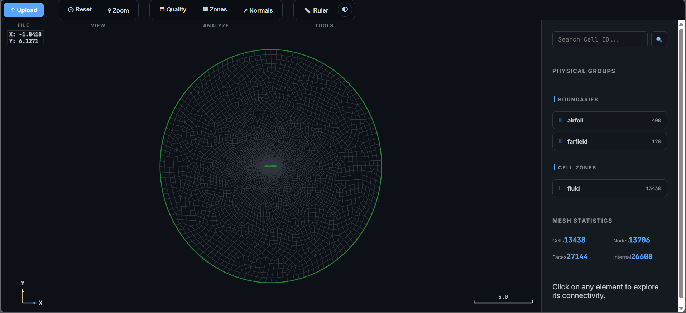

# FVM 2D Mesh Explorer

A high-performance, interactive 2D Finite Volume Method (FVM) mesh explorer and topology analysis suite. Designed for CFD engineers and researchers to visualize and verify complex unstructured meshes with ease.



## Key Features

- **High-Performance Rendering**: Optimized for meshes with **0.1M+ cells**, with viewport culling and level-of-detail (LOD) rendering.
- **Advanced Diagnostics Suite**:
  - **Mesh Quality Heatmap**: Real-time **Aspect Ratio** analysis with a Green-to-Red color gradient.
  - **Boundary support (▥)**: Full parsing of **Inlet, Outlet, and Wall** physical groups with categorized sidebar controls and selective highlighting.
  - **Face Normals (↗)**: Visualization of FVM orientation vectors for flux consistency verification.
- **Spatial Orientation & Measurement**:
  - **Interactive Ruler (📏)**: Click-to-click measurement of world-space distances and coordinate deltas ($\Delta X, \Delta Y$).
  - **Dynamic Scale Bar**: Auto-adjusting physical context indicator.
  - **Axis Compass**: Fixed-position orientation indicator in the canvas viewport.
- **Professional Analytics UI**: Grouped control sets (**View, Analyze, Tools**) with a sleek "Industrial Slate" aesthetic and **Glassmorphism** overlays.## Technical Highlights

- **Face-Based Topology**: Implements standard CFD connectivity (Face-to-Cell, Cell-to-Face, Face-to-Node) for flux-based solvers.
- **Advanced Interactions**:
  - **Area Zoom (⚲)**: Precision bounding-box selection for focused inspection.
  - **Universal Hit-Test**: Point-in-polygon selection for hybrid meshes (Triangles, Quads).
  - **Live Coordinates**: Precision readout of world-space mouse position.
- **Professional Branding**:
  - **Industrial Slate Palette**: Sleek GitHub-inspired color tokens tailored for engineering applications.
  - **Minimalist Iconography**: Technical unicode symbols replace generic emojis for a clean dashboard look.
  - **High-DPI Support**: Vector-based rendering that scales beautifully on high-resolution displays.
- **Universal Parsing**: Native support for **Gmsh .msh (v2.2)** including physical names for boundaries and internal zones.

## Technical Stack

- **C++20**: High-performance parser and topology engine.
- **Vanilla JavaScript**: Lightweight, dependency-free frontend logic.
- **HTML5 Canvas**: Accelerated 2D rendering with viewport culling and LOD.
- **OpenMP**: Multi-core parallelization for the CLI suite.

## Project Structure

```text
├── bin/              # Compiled C++ executables
├── docs/             # Technical manuals and topology guides
├── src/              # Source code
│   ├── web_explorer/ # Web application (index.html, app.js, mesh_worker.js)
│   ├── msh_parser.cpp# High-performance C++ parser
│   └── generate_naca63412.py # Airfoil coordinate generator
└── README.md         # You are here!
```

## Getting Started

### 1. Web Explorer
No installation required! Simply open the web interface:
1. Navigate to `src/web_explorer/index.html`.
2. Open it in any modern browser.
3. Drag and drop any `.msh` file from the `meshes/` folder.

### 2. C++ Parser (CLI)
To build the high-performance CLI tool:
```bash
g++ -O3 -fopenmp src/msh_parser.cpp -o bin/msh_parser
./bin/msh_parser ../meshes/naca63412.msh
```

## Sample Meshes (Centralized)

Meshes are now centralized in the root `meshes/` directory for project-wide use:

- **NACA 63-412 Airfoil**: Precise 6-series profile with C-Mesh topology.
- **Refined Circle**: 0.1M+ cells stress-test for renderer performance.
- **L-Shaped Channel**: Multi-zone hybrid mesh (Triangles + Quads).
- **Five-Pointed Star**: Complex boundary geometry with a central source zone.
- **Y-Junction (Tuning Fork)**: Multi-branch domain using spline-based curves.
- **Flower Pattern**: Highly intricate aesthetic mesh with overlapping petal topology.

## Documentation

Detailed guides are available in the [`docs/`](docs/) directory:
- [Mesh Parser Manual](docs/mesh_parser_manual.md): Detailed explanation of the `.msh` parsing logic.
- [Topology Guide](docs/topology_guide.md): Understanding the face-based connectivity implementation.

## Contributing

Feel free to fork this repository, report issues, or submit pull requests to enhance the FVM 2D Mesh Explorer!

---
*Built for the next generation of CFD analysis.*
